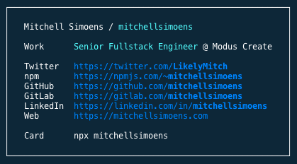

# biz-carderator

Allows building a business card that can be run in the terminal.

## Usage

You will need to create your own project and install this module in it:

```shell
# with npm
npm install biz-carderator

# with yarn
yarn add biz-carderator
```

You can then use it by passing information about yourself:

```typescript
import carderator from 'biz-carderator';
import path from 'path';
import readPkg from 'read-pkg';

(async (): Promise<void> => {
  const packageJson = await readPkg({
    cwd: path.join(__dirname, '..'),
  });

  const info = {
    name: 'Mitchell Simoens',
    github: 'mitchellsimoens',
    gitlab: 'mitchellsimoens',
    handle: 'mitchellsimoens',
    linkedin: 'mitchellsimoens',
    npm: 'mitchellsimoens',
    packageName: packageJson.name,
    twitter: 'LikelyMitch',
    website: 'https://mitchellsimoens.com',
    work: {
      company: 'Modus Create',
      title: 'Senior Fullstack Engineer',
    },
  };

  carderator(info);
})();
```

In your `package.json`, you'll need a couple important pieces. Here is a sample `package.json`:

```json
{
  "name": "mitchellsimoens",
  "version": "1.0.1",
  "description": "Business card for Mitchell Simoens",
  "main": "index.js",
  "bin": {
    "mitchellsimoens": "./bin/index.js"
  },
  "files": ["assets", "bin", "lib"],
  "scripts": {
    "build": "tsc",
    "build:check": "tsc --noEmit",
    "lint": "eslint 'bin/**/*.js' 'src/**/*.ts'",
    "lint-staged": "lint-staged",
    "start": "node -r ts-node/register src/index.ts",
    "version": "npm version patch",
    "postversion": "git push --follow-tags"
  },
  "repository": {
    "type": "git",
    "url": "git+https://github.com/mitchellsimoens/mitchellsimoens-card.git"
  },
  "publishConfig": {
    "access": "public"
  },
  "keywords": ["mitch", "mitchell", "simoens", "mitchellsimoens", "business card", "e-card", "card"],
  "author": "Mitchell Simoens <mitchellsimoens@gmail.com>",
  "license": "MIT",
  "bugs": {
    "url": "https://github.com/mitchellsimoens/mitchellsimoens-card/issues"
  },
  "homepage": "https://github.com/mitchellsimoens/mitchellsimoens-card#readme",
  "husky": {
    "hooks": {
      "pre-commit": "yarn run lint-staged"
    }
  },
  "lint-staged": {
    "src/**/*.{js,jsx,ts,tsx}": ["eslint --fix", "git add"]
  },
  "dependencies": {
    "biz-carderator": "1.0.0",
    "boxen": "4.1.0",
    "colorette": "1.1.0",
    "read-pkg": "5.2.0"
  },
  "devDependencies": {
    "@types/node": "12.6.4",
    "@types/read-pkg": "4.0.0",
    "@typescript-eslint/eslint-plugin": "1.12.0",
    "@typescript-eslint/parser": "1.12.0",
    "eslint": "6.0.1",
    "eslint-config-airbnb": "17.1.1",
    "eslint-config-prettier": "6.0.0",
    "eslint-import-resolver-lerna": "1.1.0",
    "eslint-import-resolver-typescript": "1.1.1",
    "eslint-plugin-import": "2.18.0",
    "eslint-plugin-jest": "22.9.0",
    "eslint-plugin-jsx-a11y": "6.2.3",
    "eslint-plugin-prettier": "3.1.0",
    "eslint-plugin-react": "7.14.2",
    "husky": "3.0.0",
    "lint-staged": "9.2.0",
    "prettier": "1.18.2",
    "ts-node": "8.3.0",
    "typescript": "3.5.3"
  }
}
```

The `name` is the module name that should also match the key in the `bin` object. This is so you can run `npx mitchellsimoens` without needing to install anything. This is also using typescript but you could use javascript. This is a sample output:

<center></center>
